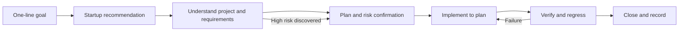

# VibeRail

A reusable AI software development workflow that can be copied into any project.

[中文 README](README.md)

It helps an AI coding agent understand the goal, repository, and impact before writing code. The agent then chooses a lightweight or full workflow based on risk, and completes the task through validation and closeout with resumable, traceable state.

## What problem does it solve?

Directly asking an AI to “implement this feature” often leads to:

- code changes before the existing project is understood;
- the same process for a small fix and a large architectural change;
- unclear requirements, scope, and acceptance criteria;
- skipped validation, regression checks, and documentation closeout;
- inaccurate recovery after an interrupted session.

This workflow breaks a development task into confirmable, resumable, and verifiable phases while allowing low-risk work to move quickly.

## Who is it for?

Good fit:

- people using Codex, Claude Code, Cursor, or similar AI coding tools;
- individual developers and small teams maintaining existing projects;
- projects where the AI should understand first, plan second, and code third;
- tasks that need interruption recovery, validation rollback, or high-risk confirmation.

Not a replacement for:

- the target project's own unit tests, integration tests, or code review;
- explicit user confirmation for high-risk changes;
- a framework-specific project template.

## 30-second quick start

Copy the `.ai/` directory into the target project's root, then send this to your AI coding tool:

```text
Please start the workflow using .ai/START.md.
Goal: fix the login button doing nothing
Recommend a path and let me confirm it.
```

To continue an interrupted task:

```text
Please continue using .ai/START.md.
```

The workflow does not overwrite the target project's existing `README.md`, `AGENTS.md`, or other root-level files.

### Complete example

User request:

```text
Fix the login button doing nothing. Recommend a path and let me confirm it.
```

Agent recommendation:

```text
mode: brownfield
weight: light
type: bugfix
interaction: low_touch
next phase: recon
```

After the user accepts the recommendation:

```text
recon → plan → build → verify → close
```

If verification fails, the workflow returns to `build` for a fix instead of claiming completion.

## How it works



Typical path:

```text
Goal → startup recommendation → phase progression → verify → close
```

Low-risk tasks can start quickly. Changes involving shared modules, permissions, data, architecture, or difficult rollback require explicit confirmation before implementation.

## Typical workflows

### Small bugfix

```text
recon → plan → build → verify → close
```

For example, fixing a login button that sends two requests when clicked twice. Analysis phases may be merged, but verification and closeout remain required.

### New feature or large refactor

```text
discover → spec → architecture → plan → build → verify → close
```

For example, adding bulk user import with data validation, permissions, error handling, tests, and rollback planning.

### Verification failure

```text
verify → build → verify → close
```

A failed verification cannot be marked complete. The workflow returns to an allowed phase for a fix and requires verification again before closeout.

### Production hotfix

```text
minimal recovery → verify → close
```

Immediate recovery and root-cause remediation are separate tasks, preventing a production recovery from turning into an uncontrolled large refactor.

## Core capabilities

- **Quick startup**: clear goals use a recommendation package by default, reducing unnecessary interviews.
- **Risk-based routing**: `full`, `light`, and `auto` fit different task sizes.
- **Interaction modes**: `low_touch`, `standard`, and `deep` are independent of workflow weight.
- **Phase gates**: no business code before confirmation; high-risk changes require separate confirmation.
- **Resumable state**: `STATE.md`, `TASKS.md`, and checkpoints preserve progress.
- **Failure recovery**: failed verification returns to `build` or `plan` through the phase machine.
- **Semantic context scopes**: hot state snapshot, core operating rules, current phase card, and detailed reference rules.
- **Host adaptation**: native choice UI is preferred, with text choices as fallback.
- **Project agnostic**: no dependency on a specific language, framework, or AI product.

## Automated validation

The project includes two types of automated checks:

```bash
node .ai/check-consistency.mjs
```

This checks documents, state snapshots, phase cards, phase transitions, completion gates, and terminology consistency. It also runs the workflow trace tests.

```bash
node .ai/tests/workflow-traces.mjs
```

The current suite covers five core traces:

- successful light bugfix;
- successful full feature;
- verification failure followed by a build recovery;
- build blocked before Gate 2 confirmation;
- checkpoint pause and resume.

Example output:

```text
workflow trace tests
- passed: lightBugfixSuccess (close)
- passed: fullFeatureSuccess (close)
- passed: verifyFailureThenRebuild (close)
- passed: gate2BlocksBuild (build)
- passed: resumeFromCheckpoint (build)
```

These tests validate workflow behavior. They do not replace the target project's own unit, integration, or end-to-end tests.

## Workflow weight

| Mode | Description | Use it for |
|------|-------------|------------|
| `full` | All phases enabled | New projects, large features, architecture, or cross-module changes |
| `light` | Analysis phases combined | Small features, local fixes, configuration, and documentation |
| `auto` | AI recommends based on risk | Unclear task size |

## Direct coding vs. this workflow

| Ask an AI to code directly | Use this workflow |
|---|---|
| Modify code immediately | Understand the goal and repository first |
| Use one process for every task | Choose `full`, `light`, or `auto` by risk |
| Tests are easy to skip | `verify` is a required phase |
| Recovery depends on chat history | Resume from a checkpoint |
| Completion is a verbal judgment | Use acceptance criteria and validation evidence |

## Directory structure

```text
.ai/
├── START.md                 # Startup entry point and routing
├── AGENT.core.md            # Core operating rules
├── WORKFLOW.slim.md         # Core workflow map
├── STATE.md                 # Hot state snapshot
├── STATE.schema.md          # State field definitions
├── TASKS.md                 # Current task and acceptance criteria
├── workflow-machine.json    # Legal phase transitions
├── PROMPTS/
│   ├── bootstrap.md         # Startup routing
│   ├── _common.md           # Shared interaction and closeout contract
│   └── phase-cards/         # Single main phase path
├── examples/                # Annotated behavior examples
├── tests/
│   └── workflow-traces.mjs  # Core workflow trace tests
├── AGENT.md / WORKFLOW.md   # Detailed reference rules and appendices
└── check-consistency.mjs    # Consistency check entry point
```

## Further reading

- [Startup entry point](.ai/START.md)
- [Core workflow map](.ai/WORKFLOW.slim.md)
- [Light bugfix example](.ai/examples/light-bugfix.md)
- [Full upgrade example](.ai/examples/full-upgrade.md)
- [Workflow trace tests](.ai/tests/workflow-traces.mjs)

## Key file responsibilities

| File | Purpose |
|------|---------|
| `.ai/START.md` | User entry point and startup routing |
| `.ai/STATE.md` | Hot snapshot of the current task |
| `.ai/TASKS.md` | Current task, scope, and acceptance criteria |
| `.ai/workflow-machine.json` | Legal phase transitions and task routes |
| `.ai/PROMPTS/phase-cards/` | Execution rules for each phase |
| `.ai/check-consistency.mjs` | Document, state, and behavior consistency checks |
| `.ai/tests/workflow-traces.mjs` | Core workflow trace tests |

## Maintenance

When changing the workflow itself, update the core operating rules and workflow map first, then synchronize the detailed reference rules, state schema, phase cards, and examples. Finally run:

```bash
node .ai/check-consistency.mjs
```

See `.ai/MAINTENANCE.md` for the detailed maintenance rules.

## FAQ

### Do all tasks need the full workflow?

No. Use `light` for small bugs, local UI changes, configuration, and documentation. Use `full` or `auto` for new projects, cross-module features, and architecture changes.

### Does `light` skip verification?

No. It combines analysis phases, but `verify` and `close` remain required.

### Which AI tools are supported?

The workflow is product-agnostic. It prefers native choice capabilities from the host and falls back to text choices, so it can be adapted to AI coding tools that can read project files and modify code.

### Does it modify the target project's root directory?

By default, only the `.ai/` directory is needed. Workflow state, tasks, decisions, and phase records live in `.ai/`; business code changes are determined by the task itself.

### How do I resume an interrupted task?

Send:

```text
Please continue using .ai/START.md.
```

The workflow reads the checkpoint and resumes from the last safe phase.

### How do I customize the workflow?

Modify `.ai/PROMPTS/phase-cards/`, `.ai/workflow-machine.json`, or the core rules, then run:

```bash
node .ai/check-consistency.mjs
```

### How is this different from a regular `AGENTS.md`?

`AGENTS.md` usually describes project conventions. This workflow additionally manages task startup, phase progression, risk confirmation, checkpoints, validation recovery, and closeout records. They can be used together.
